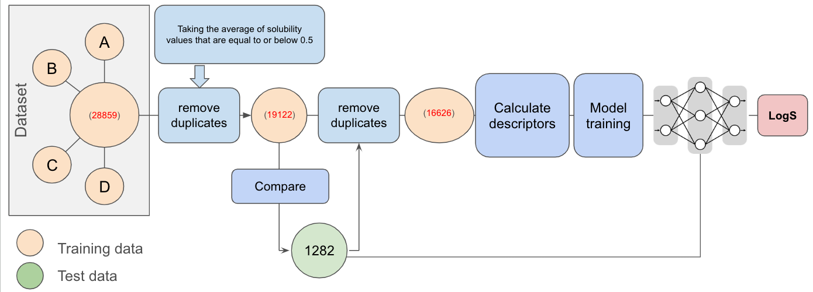

# Water Solubility Prediction Study

## Overview

This repository contains the code, data, and models used in a comprehensive study on water solubility prediction. The study focuses on training and testing various machine learning models using curated datasets from literature and benchmark datasets, comparing the performance of different descriptors, and evaluating the models against existing state-of-the-art methods.
## Workflow from data gathering, preprocesiing, model training and prediction of solubility 

## Datasets

The study utilizes four primary datasets for training and testing, which are sourced from the literature. These datasets are combined, preprocessed, and then split into final training and test sets. The datasets used are in the folder of 
**data/sourced_data** 

1. **water_solubility_data.csv** (900 samples)
2. **dataset-not-FA.csv** (6,154 samples)
3. **Supplementary_data.csv** (9,943 samples)
4. **data_paper.csv** (11,862 samples)
5. **dataset-E.csv** (1,282 Test set - samples)

The combined dataset results in a total of 28,859 datapoints.

### Preprocessing

Preprocessing of the datasets is conducted in the `data_preprocess_new.ipynb` notebook. The steps include:
- **Removing duplicates**: Ensuring that no duplicate entries exist within the combined dataset.
- **Canonical SMILES**: Generating canonical SMILES strings to identify and remove matching data points between the training and test datasets.
- **Final Dataset**: After preprocessing, the final datasets are in the folder **data/final_data**  and files are 
  - Training data: **final_unique_train.csv** (17,737 samples)
  - Test data: **final_unique_.csv** (1,282 samples)

## Model Training

Once the training and test datasets were finalized, various models were trained and evaluated. The training process and model evaluation are detailed in the `model_traning.ipynb` in the folder **notebook**.

### Descriptors and Feature Engineering

The study explored a wide range of descriptors to improve model performance:
- **Basic to Advanced Descriptors**: The `utilities.py` in the notebook folder script generates combinations of descriptors ranging from 4 basic descriptors to 123 advanced descriptors, including fingerprints of varying lengths (from 128 bits to 1024 bits).
- **Feature Engineering**: The `feature_engineered_analysis.ipynb` in the folder **notebook** introduces 38 feature-engineered descriptors and 7 functional group descriptors.

## Complete Descriptors

The complete list of descriptors used in this project is provided in the [descriptors_detail.md](descriptors_detail.md) file.

### Model Evaluation

The best-performing model and its parameters were selected based on minimizing the Mean Absolute Error (MAE). The comparative results are stored in the `model_results.csv` file and 'compare_results_new.csv'in the folder **Results**.

## Comparison with Sorkun's Work

The study also includes a detailed comparison with Sorkun et al.'s work, which used the same benchmark dataset (`dataset-E.csv`). A crucial finding was the presence of overlapping data between the training and test sets in Sorkun's preprocessing. After removing these overlaps, the MAE increased from 0.35 to 0.54, indicating the importance of proper data preprocessing.

This analysis is documented in the `Sorkundata_improve_Preprocess.ipynb` notebook, with the overlapping compounds listed in the `overlap_data_new.csv` and sorkin train and test data in the folder **data/sorkun_data** file.

## External Evaluation

The model was further evaluated using other online prediction tools, such as VCC Lab, and compared against Sorkun's model using self-experimented compound solubility data. These compounds were experimentally tested in the lab to obtain their solubility values. The experimental details and results are provided in the **Sol_exp** folder which has excel file for more detail abaout the Solubility experimet.The results of this comparison are saved in the **Results/compare_results.csv**` file.
We have also evaluated our model on the JCIM data suggested by reviewer
Predciction on this data given the in the folder **JCIM_Predcition** 
'JCIM_set1_prediction.csv' (Prediction result on set1 )
'JCIM_set2_prediction.csv' (Prediction result on set2 )
JCIM_test.xlsx' (given file)

## Repository Structure

- **data/Sourced_data**: Contains all datasets used in the study.
  - `water_solubility_data.csv`
  - `dataset-not-FA.csv`
  - `Supplementary_data.csv`
  - `data_paper.csv`
  - `dataset1-E.csv`
    
  **data/raw_data**: contains raw data with C_ID and inchikey for tracking the data 
  - `Dataset-A.csv`
  - `Dataset-B.csv`
  - `Dataset-C.csv`
  - 'Dataset-D.csv'
  - 'Dataset-E.csv'
    
  **data/raw_curated**: contains all combined and merged data in single file train and test
  - 'curated_raw_test.csv'
  - 'curated_raw_train.csv'
    
  **data/final_data**: contains all unique data which can be used for training the model
  - 'final_unique_train.csv'
  - 'final_unique_test.csv'
    
  **data/duplicate_data**:contains duplicates data from train and test while preprocessing 
  - 'duplicates_test18.csv'
  - 'duplicates_train15427.csv'
    
  **data/sorkun_data**:contains data which we have used to improve the sorkun preprocessing steps and also included 133 compounds whic 
     overlap between train and test data
  - 'Sorkun_test.csv'
  - 'Sorkun_train.csv'
  - 'overlap_data_new1.csv'
    
  **data/JCIM_Prediction**:contains predcited result  along with original data from the link which we have predicted on the train data 17884 as we have removed 37 mathcing data ponits frpm set1 and 16 matching data points from set2 in order to have fair comparison. 
   - 'JCIM_set1_prediction.csv'
   - 'JCIM_set2_prediction.csv'
     
- **notebooks/**: Jupyter notebooks containing the analysis, preprocessing, and model training code.
  - `data_preprocess_new.ipynb`
  - `model_traning.ipynb`
  - `feature_engineered_analysis.ipynb`
  - `Sorkundata_improve_Preprocess.ipynb`
  - 'standard_deviation.ipynb'
  - `JCIM_test.ipynb`

- **scripts/**: Function to create the discriptors used in the study.
  - `utilities.py`

- **results/**: Contains the comparative model results.
  - `model_results_new1.csv`
  - `compare_results_new1.csv`

- **Sol_exp/**: Contains the Experimental solubility values for five specific compounds and experiment steps 
  - `EXP40_823.xlsx`
  - `EXP42_827.xlsx`
  - `EXP56_1562.xlsx`
  - `EXP76_1593.xlsx`
  - `EXP8_260.xlsx`
  - `Steps_for_solubility_experiment.md`

## Installation

**1 Clone the Repository**  
Run the following command to clone the repository:  

- git clone https://github.com/ComPlat/water-solubility-prediction.git

- cd water-solubility-prediction

**on mac**

 python -m venv venv
 
 source venv/bin/activate

**on windows**

 python -m venv venv
 
 venv\Scripts\activate

** run the jupyter notebbok cell by cell to reproduce the results 
  

## License

This project is licensed under the MIT License.

## Contact

For any questions or further information, you can contact:

- **Mushtaq Ali** - [mushtaq.ali@kit.edu](mailto:mushtaq.alii@kit.edu)
- **Nicole Jung** - [nicole.jung@kit.edu](mailto:nicole.jung@kit.edu)

- **Institution**:  - [https://www.ibcs.kit.edu](https://www.ibcs.kit.edu)

## Conclusion

This study presents a thorough investigation into the prediction of water solubility using machine learning models. By carefully curating datasets, engineering features, and comparing with state-of-the-art methods, the study provides insights into the challenges and opportunities in this field. The findings highlight the importance of data preprocessing and feature selection in building robust predictive models.

For any questions or further information, please feel free to open an issue or contact me directly over mail id mushtaq.ali@kit.edu.

